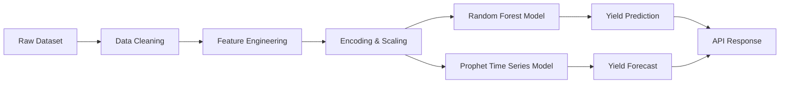
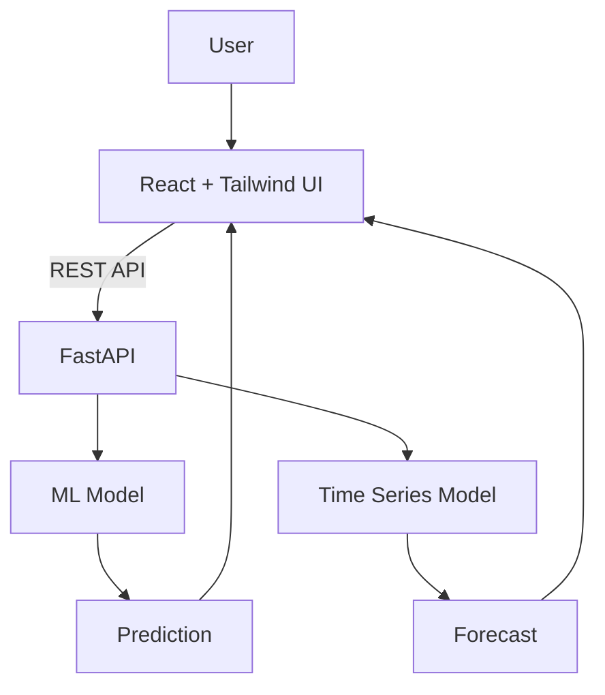

# 🌱 AgriYield Predictor
### 🚜 AI-Powered Crop Yield Prediction & Forecasting Platform

<p align="center">


</p>

---

# Main Github Repository :- https://github.com/springboardmentor789r/AgriYield

---

# 🎬 Project Demo

<p align="center">

[](https://youtu.be/5UqpzGgKfBg)

</p>

▶ Click the image above to watch the full demo of the AgriYield Predictor web application.
---

# 🚀 Live Application

| Service | Link |
|------|------|
| 🌐 Frontend | https://agriyield-predictor-system.vercel.app |
| ⚙ Backend API | https://agriyield-backend-c5nc.onrender.com |
| 📊 API Docs | https://agriyield-backend-c5nc.onrender.com/docs |

---

# 🌾 Project Overview

AgriYield Predictor is a **Full Stack AI application** that helps predict crop production using **soil characteristics and environmental conditions**.

The system integrates:

- **Machine Learning (Random Forest)**
- **Time Series Forecasting (Prophet)**
- **Interactive Data Visualization**
- **Cloud Deployment**

to deliver **data-driven agricultural insights**.

---

# 🧠 Key Features

| Feature | Description |
|------|------|
| 🎯 Crop Yield Prediction | Random Forest model predicts crop yield |
| 📈 Time Series Forecast | Prophet model forecasts yield trends |
| 🌦 Climate Inputs | Temperature, Humidity, Wind Speed |
| 🌱 Soil Analysis | Soil Type, Soil pH, Soil Quality |
| 📊 Visual Insights | Dynamic charts using Chart.js |
| 🌐 Full Stack | React + FastAPI |
| 📱 Responsive UI | Mobile friendly interface |

---

# 📊 Machine Learning Pipeline



---

# 🧬 Machine Learning Models

| Model | Purpose | Performance |
|------|------|------|
| Random Forest Regressor | Predict crop yield | R² Score > **0.95** |
| Prophet | Forecast future yield | Stable trend prediction |

---

# 📊 Forecast Visualization

Example output chart:

<p align="center">


</p>

*(Your app generates charts like this dynamically using Chart.js)*

---

# 🌍 System Architecture



---

# 🧩 Technology Stack

## 🔙 Backend

| Technology | Purpose |
|------|------|
| Python | Core backend |
| FastAPI | REST API framework |
| Scikit-learn | Machine Learning |
| Prophet | Time Series Forecast |
| Pandas / NumPy | Data Processing |
| Joblib | Model Serialization |

---

## 🎨 Frontend

| Technology | Purpose |
|------|------|
| React.js | Frontend framework |
| Tailwind CSS | Styling |
| Axios | API communication |
| Chart.js | Data visualization |
| React Router | Navigation |

---

# 📂 Project Structure

```
AgriYield-Predictor
│
├── backend
│   ├── main.py
│   ├── SavedModel.pkl
│   ├── prophet_model.pkl
│   ├── prophet_scaler.pkl
│   ├── featuresaved.pkl
│   ├── requirements.txt
│   └── Procfile
│
├── frontend
│   ├── src
│   │   ├── pages
│   │   │   ├── Predict.jsx
│   │   │   └── Forecast.jsx
│   │   ├── components
│   │   └── api.js
│   ├── package.json
│   └── vite.config.js
│
└── README.md
```

---

# ⚙ Installation Guide

## 1️⃣ Clone Repository

```bash
git clone https://github.com/farhanabid786/AgriYield-Predictor.git

cd AgriYield-Predictor
```

---

## 2️⃣ Backend Setup

```bash
cd backend

pip install -r requirements.txt

uvicorn main:app --reload
```

Backend runs on

```
http://localhost:8000
```

---

## 3️⃣ Frontend Setup

```bash
cd frontend

npm install

npm run dev
```

Frontend runs on

```
http://localhost:5173
```

---

# ☁ Deployment

| Component | Platform |
|------|------|
| Frontend | Vercel |
| Backend | Render |
| Model Storage | Google Drive |

---

# 📈 Example Prediction Flow

```
User Inputs Data
        ↓
Frontend Sends API Request
        ↓
FastAPI Backend Processes Input
        ↓
Random Forest Predicts Yield
        ↓
Prophet Forecasts Trend
        ↓
Results Returned to UI
        ↓
Charts & Metrics Displayed
```

---

# 🔮 Future Enhancements

🚀 Real-time weather integration  
🚀 Satellite-based crop monitoring  
🚀 Farmer dashboard analytics  
🚀 Multi-region agricultural predictions  
🚀 Mobile app version  

---

# 🏆 Internship Project

Developed as part of:

**Infosys Springboard Virtual Internship 6.0**

Theme: **AI in Agriculture**

---

# 👨‍💻 Author

**Farhan Abid**

📧 Email  
f.abid.work@gmail.com  

🔗 LinkedIn  
http://www.linkedin.com/in/farhan-abid-8001a9253  

🐙 GitHub  
http://github.com/farhanabid786  

---

# ⭐ Support

If you like this project:

⭐ Star the repository  
🍴 Fork it  
🤝 Contribute improvements

---

# 📜 License

© 2025 Farhan Abid  
All rights reserved.


